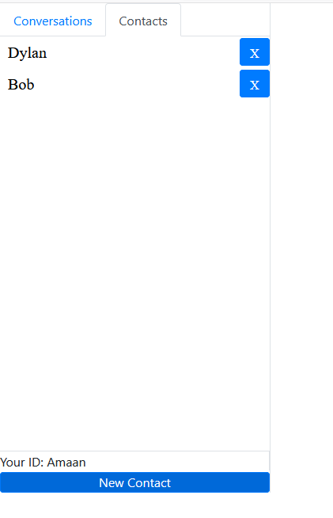

Instructions to run program:

1.Clone and pull repository 2.Type and enter "cd messenger" on the git bash 3.Type and enter "npm start" on the git bash 4.Go to localhost:3000

This app allows you to login with a chosen name or generate a random name.
It also allows you to create contacts, delete contacts, create conversations
with one or more people, delete said conversations, add messages as the
reciever (messages on the left side) or as the sender (messages on the right side).
This app also uses a custom hook to store information in local storage.

I used this app to help build my knowledge of react and react bootstrap and learned
how to efficiently use the useState, useEffect, useRef, and useContext hooks.

PHOTOS:

LoginPage:

 
Create New Contact Modal:

 
Added Contacts:

 
Create New Conversation Modal:

 
Added Conversations:

 
Entire Dashboard with Active Messages:

